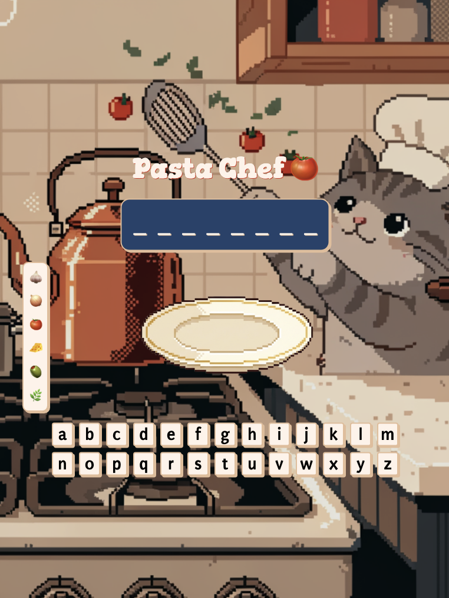

# Pasta Chef 🍅

A word guessing game built with HTML, SCSS, and vanilla JavaScript. Same concept as Hangman - guess the word before you run out of attempts.

## Screenshot



## How to Play

- You get 6 attempts per word
- Click a letter (or press a key) to guess
- Correct guess: the letter appears in the word, and an ingredient gets added to the plate
- Wrong guess: attempt count goes down
- Guess all letters before hitting 0 to win

## Features

- Keyboard click and physical keydown support
- Pantry that depletes as ingredients move to the plate
- Win/lose modal with Play Again
- Responsive layout (mobile, tablet, desktop)

## Tech Stack

- HTML5
- SCSS (with partials and BEM naming)
- Vanilla JavaScript (ES6+)

## Project Structure

```
├── index.html
├── script.js
├── styles.scss
├── output.css
├── example-words.json
├── assets/
│   ├── pixel-art-cat-cooking.png
│   └── plate.png
└── scss/
    ├── partials/
    │   ├── _colors.scss
    │   ├── _fonts.scss
    │   └── _variables.scss
    └── sections/
        ├── _header.scss
        ├── _word.scss
        ├── _plate.scss
        ├── _pantry.scss
        ├── _attempts.scss
        ├── _keyboard.scss
        └── _modal.scss
```

## Running Locally

Open `index.html` in a browser. SCSS needs to be compiled to `output.css` - run your SCSS watcher in the project root:

```bash
sass --watch styles.scss:output.css
```
